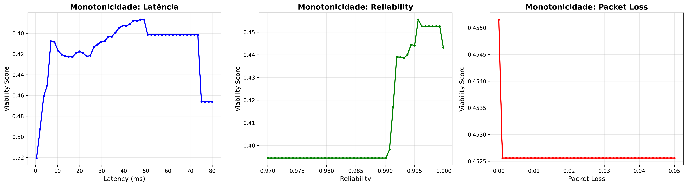

# FASE 3.2 — TESTES DE MONOTONICIDADE

**Data:** 2025-12-02 10:15:01

## Resumo Executivo

Este relatório apresenta os resultados dos testes de monotonicidade do modelo ML-NSMF v3.7.0.

## Resultados

### LATENCY

- **Correlação:** -0.2414
- **Violações:** 16
- **Taxa de Violação:** 0.3265
- **Status:** ⚠️  Monotonicidade fraca

### RELIABILITY

- **Correlação:** 0.8041
- **Violações:** 17
- **Taxa de Violação:** 0.3469
- **Status:** ✅ Monotônico (correlação positiva forte)

### PACKET_LOSS

- **Correlação:** -0.2425
- **Violações:** 13
- **Taxa de Violação:** 0.2653
- **Status:** ⚠️  Monotonicidade fraca

## Gráficos

## Conclusão

⚠️  **Algumas features apresentam monotonicidade fraca. Revisar modelo pode ser necessário.**
