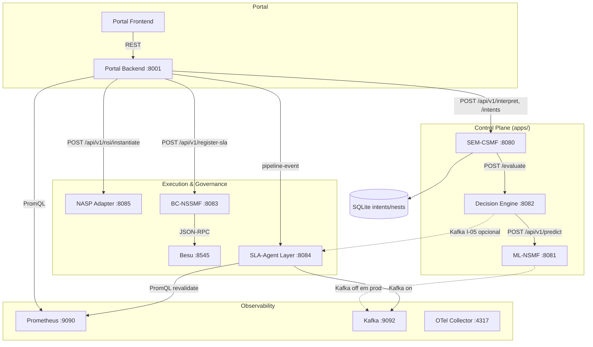
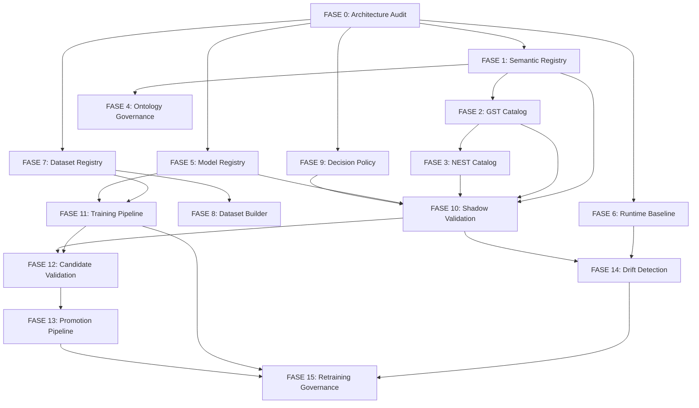

# TRISLA_EVOLUTION_MASTER_PLAN_V1

**Documento:** Plano Mestre de Evolução Controlada do TriSLA  
**Versão:** 1.2  
**Data:** 2026-06-12  
**Status:** `MASTER_PLAN_STATUS = UPDATED_V1_2` — aguardando aprovação humana (v1.2)  
**Autor:** Arquitetura de Plataforma TriSLA (Fase de Planejamento)

---

## 1. Propósito e Princípios

Este documento define a evolução controlada do TriSLA sem regressão e sem comprometer:

- runtime atual em produção (NASP);
- baseline científico congelado (`TRI_SLICE_SEMANTIC_BASELINE_COMPLETE`, evidências `evidencias_sem_rebaseline_*`);
- resultados congelados de validação;
- arquitetura validada (HTTP-first, Helm digest-pinned SSOT);
- rastreabilidade de interfaces (`docs/INTERFACE_TRACEABILITY_MATRIX.md`);
- governança de deploy (GHCR + digest pinning);
- proteção semântica congelada (seção 4 — SEMANTIC FREEZE PROTECTION);
- proteção de datasets científicos (seção 5 — DATASET FREEZE PROTECTION);
- proteção de deployment congelado (seção 6 — DEPLOYMENT FREEZE PROTECTION);
- proteção de infraestrutura operacional (seção 7 — INFRASTRUCTURE FREEZE PROTECTION).

**Regra absoluta:** Nenhuma fase inicia implementação antes da aprovação formal da fase anterior. Nenhuma fase modifica produção, Decision Engine, ML-NSMF, SEM-CSMF ou SLA-Agent antes da aprovação correspondente.

**Ao concluir este documento:** não implementar. Parar. Aguardar aprovação humana. Somente após aprovação deste plano poderá ser iniciada a Fase 0 (execução).

---

## 2. Estado Atual — Resumo Executivo

### 2.1 Componentes em Runtime

| Componente | Path SSOT | Serviço K8s | Porta | Registry |
|------------|-----------|-------------|-------|----------|
| SEM-CSMF | `apps/sem-csmf/` | `trisla-sem-csmf` | 8080 | GHCR digest |
| ML-NSMF | `apps/ml-nsmf/` | `trisla-ml-nsmf` | 8081 | GHCR digest |
| Decision Engine | `apps/decision-engine/` | `trisla-decision-engine` | 8082 | GHCR digest |
| BC-NSSMF | `apps/bc-nssmf/` | `trisla-bc-nssmf` | 8083 | GHCR digest |
| SLA-Agent Layer | `apps/sla-agent-layer/` | `trisla-sla-agent-layer` | 8084 | GHCR digest |
| NASP Adapter | `apps/nasp-adapter/` | `trisla-nasp-adapter` | 8085 | GHCR digest |
| Hyperledger Besu | `apps/besu/` | `trisla-besu` | 8545 | GHCR digest |
| Portal Backend/Frontend | `apps/portal-*/` | `trisla-portal-*` | 8001/32001 | tag (divergência) |
| Kafka | `apps/kafka/` | `kafka.trisla.svc` | 9092 | GHCR digest |
| Prometheus | externo + chart | `monitoring-kube-prometheus-prometheus` | 9090 | — |

**SSOT de código:** `apps/` + `helm/` na raiz. Evitar `TriSLA/` (clone espelhado) e `sla-agent-layer/` na raiz (cópia parcial divergente).

### 2.2 Lacunas Confirmadas

| Lacuna | Evidência |
|--------|-----------|
| GST/NEST gerados por templates simplificados | `intent_processor.py`, `nest_generator_base.py` |
| Valores hardcoded (100 Mbps, 1 Gbps, 1 ms, 0.99999) | `intent_processor.py`, `main.py`, `semantic_resolver.py` |
| Ausência de Semantic Registry | Apenas OWL/TTL estáticos em `apps/sem-csmf/src/ontology/` |
| Ausência de Model Registry (serviço) | Apenas `apps/ml-nsmf/models/registry/` (arquivos) |
| Ausência de Runtime Baseline Registry | Evidências em `evidencias_*` e `DB-*.json` |
| Ausência de Dataset Registry | CSV manual em `TriSLA/apps/ml-nsmf/data/` |
| Ausência de Shadow Validation | Não implementado |
| Ausência de Retraining Governance | Treinamento manual via scripts |
| Divergência runtime vs baseline científico | Ontology fallback 1000 Mbps vs template 100 Mbps eMBB |
| Divergência Helm | `values.yaml` (digest) vs `values-nasp.yaml` (tags v3.9.4) |
| Risco código→imagem→digest→deployment→pod | Histórico de patch no Git ausente no runtime; frontend/backend dessincronizados |
| Infraestrutura sem baseline formal | Namespaces, ConfigMaps, PVCs não centralizados em registry |

### 2.3 Fluxo de Dependências (Runtime Atual)



**Caminho de produção:** HTTP (SEM → DE → ML). Kafka habilitado apenas para SLA-Agent em Helm; ML-NSMF com `KAFKA_ENABLED: false`.

---

## 3. Regras Transversais

### 3.1 Deploy

| Permitido | Proibido |
|-----------|----------|
| Build por digest (`sha256:…`) | Tag `latest` |
| Push GHCR (`ghcr.io/abelisboa/trisla-*`) | Tags mutáveis em produção |
| Deploy remoto via Helm | Rollout sem digest |
| Digest pinning em `helm/trisla/values.yaml` | Deploy direto em pod sem chart |

Helper Helm (`helm/trisla/templates/_helpers.tpl`): digest obrigatório — "TAG NÃO É PERMITIDA" no SSOT.

### 3.2 Evidências por Fase

Cada fase deve gerar pacote:

```
evidencias_trisla_<fase>_<timestamp>/
├── arquitetura/
├── logs/
├── manifests/
├── screenshots/
├── validacoes/
└── rollback_plan.md
```

### 3.3 Componentes Protegidos (até aprovação da fase correspondente)

| Componente | Fases que podem alterá-lo |
|------------|---------------------------|
| SEM-CSMF | Fase 1+ (Semantic), Fase 2+ (GST), Fase 3+ (NEST) |
| ML-NSMF | Fase 5+ (Model Registry), Fase 11+ (Training) |
| Decision Engine | Fase 9+ (Policy Registry), Fase 10+ (Shadow) |
| SLA-Agent Layer | Fase 10+ (Shadow), Fase 14+ (Drift) |
| NASP Adapter | Somente via fases de integração aprovadas |
| BC-NSSMF / Besu | Somente via fases de governança aprovadas |

### 3.4 Critério de Aprovação entre Fases

Toda transição exige:

1. Exit Gate da fase anterior atendido (checklist 100%).
2. Pacote de evidências arquivado e revisado.
3. Aprovação formal registrada (issue/PR/comitê) com timestamp.
4. Rollback plan validado e ensaiado quando aplicável.

---

## 4. SEMANTIC FREEZE PROTECTION

### Objetivo

Impedir regressão semântica. Proteger a arquitetura semântica congelada e toda artefato derivado.

### Artefatos Protegidos

- Ontologias OWL (`trisla_complete.owl`, `trisla.ttl`)
- Regras SWRL e inferências
- GST Catalog (templates e catálogos)
- NEST Catalog (templates e catálogos)
- Semantic Mappings (Ontologia → GST, GST → NEST, Ontologia → NEST)
- Semantic Templates (`intent_processor`, `semantic_resolver`)
- Semantic Policies

### Regras

Nenhuma fase pode alterar ontologias, GST, NEST ou semantic mappings sem:

1. **Análise de impacto** documentada (componentes, APIs, decisões, baseline D1–D6)
2. **Evidência** de paridade ou justificativa de mudança
3. **Aprovação humana** explícita registrada com timestamp

Violação detectada → `REGRESSION_DETECTED` → parar imediatamente.

### Evidências Obrigatórias — Semantic Baseline

Registrar em cada pacote de evidências e no Runtime Baseline Registry (Fase 6):

```text
Semantic Baseline
├── ontology_version
├── gst_version
├── nest_version
├── mapping_version
└── semantic_rules_version
```

Fontes SSOT para baseline semântico: `apps/sem-csmf/src/ontology/`, `evidencias_sem_rebaseline_*`, veredito `TRI_SLICE_SEMANTIC_BASELINE_COMPLETE`.

---

## 5. DATASET FREEZE PROTECTION

### Objetivo

Impedir regressão em datasets científicos. Proteger integridade e rastreabilidade de todos os datasets usados em treinamento, validação e publicação.

### Artefatos Protegidos

- Datasets de treinamento (`trisla_ml_dataset.csv`, outputs v6)
- Datasets de validação
- Datasets das campanhas congeladas (`RESULTS_FREEZE_MAIN`, `evidencias_multidomain_stress_campaign_v2_*`)
- Datasets de stress multidomínio

### Regras

Nenhuma fase pode alterar, substituir ou remover datasets sem:

1. **Evidência** de origem, checksum e diff
2. **Validação** contra baseline científico e campanhas congeladas
3. **Aprovação humana** explícita

### Evidências Obrigatórias — Dataset Baseline

Registrar em cada pacote de evidências e no Dataset Registry (Fase 7):

```text
Dataset Baseline
├── dataset_id
├── origem
├── checksum (SHA256)
├── utilização (treino / validação / inferência / publicação)
└── campanha_associada
```

Fonte SSOT primária: `MASTER_SSOT_POINTER.md` → `RESULTS_FREEZE_MAIN` (`aeb26946e0b2f81064372dfd3f743cd3492e207db0bb29c789f7983fe2c9e1f6`).

---

## 6. DEPLOYMENT FREEZE PROTECTION

### Objetivo

Impedir divergência entre código fonte, imagem construída, digest aprovado, deployment Kubernetes e runtime efetivamente executado.

### Problemas Históricos a Prevenir

| Problema | Risco |
|----------|-------|
| Patch presente no Git mas ausente no runtime | Comportamento não reproduzível |
| Digest correto no repositório mas diferente no cluster | Deploy não auditável |
| Frontend atualizado e backend antigo | Regressão E2E silenciosa |
| `values` divergentes entre ambientes | Baseline inválido |
| Deployment usando imagem diferente da aprovada | Violação de governança digest |

### Regras

Nenhuma fase pode substituir imagens, alterar digest ou alterar deployments sem:

1. **Evidência** (diff Git, helm, kubectl, GHCR)
2. **Validação** (consistency matrix atualizada)
3. **Aprovação humana** explícita com timestamp

Violação detectada → `DEPLOYMENT_DRIFT_DETECTED` → parar imediatamente.

### Evidências Obrigatórias — Deployment Baseline

Registrar em cada pacote de evidências e no Runtime Baseline Registry (Fase 6):

```text
Deployment Baseline
├── deployment (nome)
├── imagem (repository)
├── digest (sha256)
├── namespace
├── replicas
└── data_aprovacao
```

Cadeia obrigatória por componente crítico:

```text
Code → Image → Digest → Deployment → Pod
```

Fontes SSOT: `helm/trisla/values.yaml`, `helm/trisla/values-nasp.yaml`, `helm/trisla-portal/values.yaml`, `TriSLA/.github/workflows/ci-ghcr-build.yaml`.

---

## 7. INFRASTRUCTURE FREEZE PROTECTION

### Objetivo

Proteger a infraestrutura operacional utilizada pelo TriSLA contra alterações não governadas.

### Escopo Protegido

- namespaces (`trisla`, `monitoring`, domínios NASP)
- services, ingress, NodePorts
- configmaps, secrets referenciados (nomes/keys — sem expor valores)
- PVCs, volumes
- service accounts
- network policies

### Regras

Nenhuma fase pode alterar infraestrutura sem:

1. **Análise de impacto** (componentes dependentes, SLO, telemetria)
2. **Evidência** (snapshot antes/depois, checksums)
3. **Aprovação humana** explícita

Violação detectada → `INFRASTRUCTURE_DRIFT_DETECTED` → parar imediatamente.

### Evidências Obrigatórias — Infrastructure Baseline

```text
Infrastructure Baseline
├── inventario_completo
├── checksums (ConfigMap/Helm template hash)
├── estado_atual (kubectl snapshot)
└── relacionamentos (service → deployment → PVC)
```

Fontes SSOT: `docs/TRISLA_INFRA_SSOT.md`, `helm/trisla/templates/`, snapshots Fase 0.

---

## 8. FASE 0 — Architecture Audit

### Objetivo

Produzir inventário completo e mapas de referência do estado atual — incluindo baselines semânticos, de datasets, de deployment, de infraestrutura e científicos — sem alterar código, configuração ou runtime.

### Escopo

Doze inventários/matrizes obrigatórios (ver Entregáveis), relatório de drift classificado, matriz de rastreabilidade de freezes, diagramas de dependência, gap analysis formal.

**Zero alterações** em `apps/`, `helm/`, cluster NASP. **Não executar auditorias de runtime nesta atualização documental** — a execução da Fase 0 aguarda aprovação humana.

### Entregáveis Obrigatórios

A Fase 0 somente é considerada concluída se entregar **todos** os itens abaixo:

#### 1. Architecture Inventory

Inventário completo de:

- componentes (`apps/`, satélites, exporters)
- serviços K8s e portas
- namespaces (`trisla`, `monitoring`, domínios NASP)
- integrações (HTTP, Kafka, gRPC/OTLP, Besu RPC)
- APIs (referência cruzada com `INTERFACE_TRACEABILITY_MATRIX.md`)

#### 2. Runtime Inventory

Inventário de estado do cluster (read-only):

- deployments, replicas, image digests
- services, ingress, NodePorts
- configmaps, secrets (nomes e keys — sem expor valores sensíveis)
- pods, PVCs, status

#### 3. API Inventory

Mapeamento categorizado:

- **Northbound APIs** — Portal Frontend → Portal Backend
- **Internal APIs** — SEM→DE→ML, NASP, BC-NSSMF
- **Governance APIs** — BC-NSSMF, Besu, SLA policies
- **Observability APIs** — Prometheus proxy, métricas, OTel

#### 4. Semantic Inventory

| Sub-inventário | Conteúdo |
|----------------|----------|
| **Ontologias** | arquivos OWL/TTL, versões, localização em `apps/sem-csmf/src/ontology/` |
| **Regras** | SWRL, inferências, `semantic_resolver.py` |
| **GST** | templates em `intent_processor.py`, catálogos existentes |
| **NEST** | templates em `nest_generator_base.py`, `nest_generator_db.py` |
| **Mapeamentos** | GST→NEST, Ontologia→GST, Ontologia→NEST |
| **Valores hardcoded** | 100 Mbps, 1 Gbps, 1 ms, 0.99999 e demais encontrados |

Produzir `Semantic Baseline` (seção 4) como artefato congelado.

#### 5. Model Inventory

| Sub-inventário | Conteúdo |
|----------------|----------|
| **Modelos** | Random Forest, Gradient Boosting classifier, LSTM (se presente), outros |
| **Arquivos** | localização, versão (`current_model.txt`), checksum SHA256 |
| **Features** | utilizadas e descartadas (`model_metadata.json`) |
| **Explainability** | SHAP, LIME, XAI paths em ML-NSMF e SLA-Agent |

#### 6. Dataset Inventory

| Sub-inventário | Conteúdo |
|----------------|----------|
| **Datasets** | treinamento, validação, inferência, stress campaign |
| **Origem** | scripts, campanhas, paths |
| **Uso** | treino / validação / publicação |
| **Campanhas congeladas** | link para `RESULTS_FREEZE_MAIN`, Phase 6 SSOT |

Produzir `Dataset Baseline` (seção 5) como artefato congelado.

#### 7. Hardcoded Values Inventory

Relatório completo para **todos** os hardcoded encontrados:

- localização (arquivo, linha)
- componente
- impacto (semântico, decisão, orquestração)
- risco (alto/médio/baixo)

#### 8. Scientific Freeze Traceability Matrix

Matriz de rastreabilidade cruzando:

| Freeze | Fonte SSOT |
|--------|------------|
| **Scientific Freeze** | `RESULTS_FREEZE_MAIN`, `evidencias_sem_rebaseline_*`, CLAIMS |
| **Runtime Freeze** | `TRISLA_MASTER_SSOT_RUNTIME_BASELINE_V1.md`, Phase 6 digests |
| **Dataset Freeze** | `Dataset Baseline`, campanhas multidomínio |
| **Semantic Freeze** | `Semantic Baseline`, D1–D6 verdict |
| **Model Freeze** | `models/registry/`, Decision Engine digest, metadata_v2 |
| **Deployment Freeze** | `Deployment Baseline`, GHCR digests, `values.yaml` |
| **Infrastructure Freeze** | `Infrastructure Baseline`, `TRISLA_INFRA_SSOT.md` |

#### 9. Deployment Inventory

Mapear por deployment crítico:

| Campo | Conteúdo |
|-------|----------|
| **Deployments** | nome, namespace, imagem, digest, replicas |
| **Cadeia** | Code → Image → Digest → Deployment → Pod |

Componentes críticos obrigatórios na cadeia: SEM-CSMF, ML-NSMF, Decision Engine, SLA-Agent, BC-NSSMF, NASP Adapter, Portal Backend, Portal Frontend.

Produzir `Deployment Baseline` (seção 6) como artefato congelado.

#### 10. Infrastructure Baseline

Mapear estado atual (read-only):

- namespaces
- services
- ingress
- configmaps
- secrets referenciados (nomes/keys)
- PVCs
- volumes
- service accounts
- network policies

Produzir `Infrastructure Baseline` (seção 7) com inventário, checksums, estado e relacionamentos.

#### 11. Helm Inventory

Mapear e comparar:

| Arquivo | Verificação |
|---------|-------------|
| `helm/trisla/values.yaml` | digests, env vars, replicas |
| `helm/trisla/values-nasp.yaml` | divergências vs values.yaml (tags vs digest) |
| `helm/trisla-portal/values.yaml` | URLs, imagens portal |
| Outros `values*.yaml` encontrados | sobreposições, parâmetros conflitantes |

Identificar explicitamente: divergências, sobreposições, parâmetros conflitantes.

#### 12. Runtime Deployment Consistency Matrix

Matriz obrigatória por componente crítico:

```text
Repository (Git commit/path)
    ↓
Build (workflow / Dockerfile)
    ↓
Image (ghcr.io/abelisboa/trisla-*)
    ↓
Digest (sha256)
    ↓
Deployment (Helm/kubectl)
    ↓
Pod (running imageID)
```

Componentes: SEM-CSMF, ML-NSMF, Decision Engine, SLA-Agent, BC-NSSMF, NASP Adapter, Portal Backend, Portal Frontend.

Qualquer lacuna ou divergência não explicada bloqueia exit gate e Fase 1.

### Identificação Obrigatória de Drift (durante execução da Fase 0)

Durante a execução read-only da Fase 0, identificar e classificar explicitamente:

| Tipo de Drift | Exemplos |
|---------------|----------|
| **Drift de Código** | patch no Git ausente no cluster |
| **Drift de Imagem** | imagem no pod ≠ imagem no Helm |
| **Drift de Digest** | digest em values.yaml ≠ digest em deployment |
| **Drift de Helm** | values-nasp.yaml tags vs values.yaml digest |
| **Drift de Runtime** | comportamento/API diferente do baseline |

Classificação obrigatória: `CRITICAL` | `HIGH` | `MEDIUM` | `LOW`.

Registrar em `evidencias_trisla_fase0_<timestamp>/drift_report/` com evidências por item.

### Componentes Impactados

Nenhum (somente leitura). Fontes: `apps/`, `helm/`, `docs/`, `monitoring/`, `grafana/`, `evidencias_*`, `DB-*.json`, `MASTER_SSOT_POINTER.md`.

### Riscos

| Risco | Mitigação |
|-------|-----------|
| Drift entre `apps/` e `TriSLA/` | Auditar apenas `apps/` como SSOT; documentar divergências |
| Estado do cluster diferente do Helm | Snapshot `kubectl` + comparação com `values-nasp.yaml` |
| Documentação desatualizada | Cruzar com `INTERFACE_TRACEABILITY_MATRIX.md` e código |
| Inventário semântico incompleto | Checklist §4 Semantic Inventory 100% |
| Dataset baseline sem checksum | SHA256 obrigatório por dataset |
| Drift CRITICAL não resolvido | Bloquear Fase 1 até explicação documentada ou remediação aprovada |
| Portal FE/BE dessincronizado | Consistency matrix com status explícito |

### Critérios de Aprovação

Todos obrigatórios — ausência de qualquer item bloqueia o exit gate:

- [ ] **Architecture Inventory** completo
- [ ] **Runtime Inventory** completo
- [ ] **API Inventory** completo
- [ ] **Semantic Inventory** completo + `Semantic Baseline` registrado
- [ ] **Model Inventory** completo
- [ ] **Dataset Inventory** completo + `Dataset Baseline` registrado
- [ ] **Hardcoded Values Inventory** completo
- [ ] **Scientific Freeze Traceability Matrix** completa
- [ ] **Deployment Inventory** completo + `Deployment Baseline` registrado
- [ ] **Infrastructure Baseline** completo
- [ ] **Helm Inventory** completo (divergências documentadas)
- [ ] **Runtime Deployment Consistency Matrix** completa (8 componentes críticos)
- [ ] **Drift Report** com classificação CRITICAL/HIGH/MEDIUM/LOW
- [ ] Diagrama de dependências aprovado por arquitetura
- [ ] Gap analysis assinado

### Evidências Necessárias

```text
evidencias_trisla_fase0_<timestamp>/
├── architecture_inventory/
├── runtime_inventory/
├── api_inventory/
├── semantic_inventory/
│   └── semantic_baseline.json
├── model_inventory/
├── dataset_inventory/
│   └── dataset_baseline.json
├── hardcoded_values_inventory/
├── scientific_freeze_traceability_matrix/
├── deployment_inventory/
│   └── deployment_baseline.json
├── infrastructure_baseline/
├── helm_inventory/
├── runtime_deployment_consistency_matrix/
├── drift_report/         # CRITICAL/HIGH/MEDIUM/LOW
├── arquitetura/          # diagramas
├── logs/
├── manifests/            # kubectl snapshots
├── screenshots/
├── validacoes/
└── rollback_plan.md      # N/A read-only; documentar "no rollback needed"
```

### Testes Necessários

Nenhum teste de runtime que altere estado. Validação por revisão cruzada documento ↔ código ↔ cluster ↔ GHCR ↔ Helm ↔ freezes científicos.

### Estratégia de Rollback

N/A — fase read-only.

### Build Strategy

N/A.

### Deploy Strategy

N/A.

### Validation Strategy

Peer review por 3 revisores (Arquitetura + DevOps + representante científico). Checklist **12/12** inventários/matrizes + drift report + matriz de freezes.

### Exit Gate

```text
FASE_0_ARCHITECTURE_AUDIT_APPROVED = TRUE
```

Somente quando todos os 12 inventários/matrizes + drift report estiverem presentes nas evidências e revisados.

### Regra de Entrada da Fase 1

A Fase 1 somente pode iniciar quando:

```text
FASE_0_ARCHITECTURE_AUDIT_APPROVED = TRUE
```

e:

1. Todos os inventários obrigatórios arquivados em `evidencias_trisla_fase0_<timestamp>/`
2. **Nenhuma divergência não explicada** entre Git Repository, Image, Digest, Deployment e Runtime
3. Drifts `CRITICAL` resolvidos ou explicitamente aceitos com aprovação humana documentada

```text
DEPLOYMENT_CONSISTENCY_GATE = PASS
```

---

## 9. FASE 1 — Semantic Registry

### Pré-requisito

`FASE_0_ARCHITECTURE_AUDIT_APPROVED = TRUE` + todos os 12 inventários da Fase 0 nas evidências + `DEPLOYMENT_CONSISTENCY_GATE = PASS`.

### Objetivo

Criar registro semântico versionado de intents, ontologias, vocabulários e resoluções — substituindo resolução in-process ad-hoc por catálogo consultável e auditável. Sujeito a **SEMANTIC FREEZE PROTECTION** (seção 4).

### Escopo

- Serviço ou módulo `semantic-registry` (read-heavy, versioned).
- Indexação de `trisla_complete.owl`, `trisla.ttl` e extensões futuras.
- API de consulta: `resolve(intent_fragment) → semantic_entity + provenance`.
- **Não alterar** `semantic_resolver.py` em produção até shadow validado (Fase 10).

### Componentes Impactados

- Novo: `apps/semantic-registry/` (proposto)
- Leitura: `apps/sem-csmf/src/ontology/`
- Referência: Portal Backend (futuro proxy)

### Riscos

| Risco | Mitigação |
|-------|-----------|
| Regressão semântica vs baseline D1–D6 | Comparar outputs registry vs `semantic_resolver` atual |
| Ontologia incompleta | Versionar; não deletar versões anteriores |

### Critérios de Aprovação

- [ ] Registry deployável em namespace `trisla` (sidecar ou serviço independente)
- [ ] Versionamento semver de ontologias
- [ ] API documentada (OpenAPI)
- [ ] Zero impacto no path HTTP SEM→DE em produção

### Evidências Necessárias

Manifests Helm, logs de startup, testes de consulta para URLLC/eMBB/mMTC, diff de resolução vs baseline.

### Testes Necessários

- Unit: resolução por slice type
- Integration: SEM-CSMF consulta registry em ambiente de staging
- Regression: suite D1–D6 semantic baseline

### Estratégia de Rollback

Remover deployment `semantic-registry`; SEM-CSMF continua com resolver in-process (inalterado).

### Build Strategy

`docker build` → push `ghcr.io/abelisboa/trisla-semantic-registry@sha256:…`

### Deploy Strategy

Helm subchart ou template em `helm/trisla/`; digest obrigatório; `replicas: 2`; sem alterar SEM-CSMF env até Fase 10.

### Validation Strategy

Shadow read-only: SEM-CSMF loga comparação registry vs resolver sem usar resultado.

### Exit Gate

`FASE_1_SEMANTIC_REGISTRY_APPROVED` — catálogo semântico versionado operacional em staging.

---

## 10. FASE 2 — GST Catalog Registry

Sujeito a **SEMANTIC FREEZE PROTECTION** (seção 4). Alterações em GST exigem análise de impacto, evidência e aprovação humana.

### Objetivo

Externalizar templates GST (hoje em `intent_processor._create_gst_template`) para catálogo versionado, eliminando hardcoded 100 Mbps / 1 Gbps / 1 ms / 0.99999 como única fonte.

### Escopo

- Catálogo GST por `service_type` (eMBB, URLLC, mMTC) com QoS parametrizável.
- Provenance: `template_id`, `version`, `source` (3GPP ref, tenant override).
- SEM-CSMF passa a **ler** catálogo (feature flag off em prod até Fase 10).

### Componentes Impactados

- Novo: `apps/gst-catalog-registry/` ou extensão do semantic-registry
- Referência: `apps/sem-csmf/src/intent_processor.py`
- Dados: substituir defaults hardcoded por entradas de catálogo

### Riscos

| Risco | Mitigação |
|-------|-----------|
| Quebra de baseline científico | Congelar `gst_catalog_v1_baseline` espelhando valores atuais |
| Inconsistência ontology vs GST | Cross-reference Fase 1 + validação cruzada |

### Critérios de Aprovação

- [ ] Catálogo v1 espelha exatamente valores atuais (paridade byte-a-byte em JSON)
- [ ] API `GET /catalog/gst/{service_type}/{version}`
- [ ] Documentação de cada campo QoS com referência 3GPP/ETSI

### Evidências Necessárias

Export JSON do catálogo v1, testes de paridade, manifests.

### Testes Necessários

- Paridade: output GST template atual == output catálogo v1
- Negative: versão inexistente retorna 404
- Load: 100 req/s sem degradação

### Estratégia de Rollback

Feature flag `GST_CATALOG_ENABLED=false`; fallback para `intent_processor` in-process.

### Build Strategy

Imagem dedicada ou ConfigMap versionado + sidecar; preferir serviço com digest GHCR.

### Deploy Strategy

Deploy em staging; prod somente após Fase 10 shadow approval.

### Validation Strategy

Diff automatizado GST(legacy) vs GST(catalog) para todos os slice types.

### Exit Gate

`FASE_2_GST_CATALOG_REGISTRY_APPROVED`

---

## 11. FASE 3 — NEST Catalog Registry

### Objetivo

Versionar artefatos NEST (`nest_generator_base.py`, `nest_generator_db.py`) em catálogo auditável com binding GST→NEST rastreável.

### Escopo

- Catálogo NEST por perfil de slice com atributos 3GPP TS 28.541.
- Link GST version → NEST version.
- Persistência de referência (não substituir SQLite SEM-CSMF ainda).

### Componentes Impactados

- `apps/sem-csmf/src/nest_generator_base.py`, `nest_generator_db.py`
- Novo: `apps/nest-catalog-registry/`
- SQLite `nests` table (metadados de referência)

### Riscos

| Risco | Mitigação |
|-------|-----------|
| NEST inválido para NASP instantiate | Validar schema contra NASP Adapter contract |
| Recursos default (cpu:2, memory:4Gi) não documentados | Incluir no catálogo com provenance |

### Critérios de Aprovação

- [ ] Catálogo NEST v1 com paridade ao gerador atual
- [ ] Schema validation (JSON Schema / Pydantic)
- [ ] Rastreio GST_id → NEST_id

### Evidências Necessárias

NEST samples por slice type, validation reports, NASP dry-run logs.

### Testes Necessários

- Schema validation
- E2E staging: intent → GST(catalog) → NEST(catalog) → NASP dry-run
- Regression: comparar NESTs históricos em SQLite

### Estratégia de Rollback

Flag `NEST_CATALOG_ENABLED=false`; gerador in-process.

### Build Strategy

GHCR digest; artefatos NEST em volume versionado ou DB dedicado.

### Deploy Strategy

Staging first; prod após shadow (Fase 10).

### Validation Strategy

Byte-diff NEST legacy vs catalog para dataset de regressão congelado.

### Exit Gate

`FASE_3_NEST_CATALOG_REGISTRY_APPROVED`

---

## 12. FASE 4 — Ontology Governance Registry

### Objetivo

Governança formal de mudanças em ontologias OWL/TTL: proposta → revisão → aprovação → publicação → deprecação.

### Escopo

- Workflow de change request para `trisla_complete.owl` / `trisla.ttl`.
- Integração com Semantic Registry (Fase 1).
- Política de compatibilidade backward (minor vs major).

### Componentes Impactados

- `apps/sem-csmf/src/ontology/`
- Semantic Registry (Fase 1)
- Processo de governança (docs + CI check)

### Riscos

| Risco | Mitigação |
|-------|-----------|
| Breaking change silencioso | Semver + CI diff OWL |
| Baseline científico invalidado | Major version requer re-execução suite D1–D6 |

### Critérios de Aprovação

- [ ] Workflow documentado (RFC → review → merge → publish)
- [ ] CI gate: PR com mudança OWL exige approval label
- [ ] Histórico de versões consultável

### Evidências Necessárias

Runbook de governança, exemplos de CR aprovados/rejeitados, CI logs.

### Testes Necessários

- OWL consistency check (reasoner)
- Semantic regression suite

### Estratégia de Rollback

Republicar versão anterior da ontologia no registry; nunca deletar.

### Build Strategy

Ontologias como artefatos em OCI ou Git tags; digest por release.

### Deploy Strategy

Publish to Semantic Registry; SEM-CSMF pin `ONTOLOGY_VERSION` env.

### Validation Strategy

Reasoner + suite semântica + peer review comitê.

### Exit Gate

`FASE_4_ONTOLOGY_GOVERNANCE_REGISTRY_APPROVED`

---

## 13. FASE 5 — Model Registry

### Objetivo

Elevar `apps/ml-nsmf/models/registry/` de arquivo local para registro de modelos com metadados, lineage, métricas e estágios (staging/production/archived).

### Escopo

- Serviço Model Registry (MLflow-compatible ou custom leve).
- Registrar: `viability_model.pkl`, `scaler.pkl`, `decision_classifier.pkl`.
- Metadados: features, métricas v6, promotion gates, dataset hash.
- **ML-NSMF continua carregando modelo atual** até Fase 13.

### Componentes Impactados

- Novo: `apps/model-registry/`
- Referência: `apps/ml-nsmf/models/registry/`, `predictor.py`
- CI: `TriSLA/.github/workflows/ci-ghcr-build.yaml`

### Riscos

| Risco | Mitigação |
|-------|-----------|
| Modelo errado em produção | Digest do artefato + pin explícito |
| Scaler mismatch (S34.2) | Validar par modelo+scaler como unidade |

### Critérios de Aprovação

- [ ] Todos os modelos atuais registrados com metadata completa
- [ ] API: register, get, list, stage transition (staging only)
- [ ] Integridade SHA256 por artefato

### Evidências Necessárias

Registry export, metadata JSON, checksums.

### Testes Necessários

- Upload/download roundtrip
- Predict parity: modelo registry == modelo filesystem atual

### Estratégia de Rollback

ML-NSMF mantém `MODEL_PATH` filesystem; registry é consulta only.

### Build Strategy

Registry image GHCR digest; modelos em object storage ou PVC versionado.

### Deploy Strategy

Deploy registry; ML-NSMF inalterado em prod.

### Validation Strategy

Predict output diff legacy vs registry-sourced model (staging).

### Exit Gate

`FASE_5_MODEL_REGISTRY_APPROVED`

---

## 14. FASE 6 — Runtime Baseline Registry

Integra `Deployment Baseline` (§6), `Infrastructure Baseline` (§7), `Semantic Baseline` (§4) e `Dataset Baseline` (§5) em catálogo unificado.

### Objetivo

Centralizar baselines de runtime validados (imagens digest, configs Helm, scores DE, thresholds PRB) substituindo dispersão em `evidencias_*` e `DB-*.json`.

### Escopo

- Catálogo de baselines: `baseline_id`, component digests, helm values hash, timestamp, verdict.
- Referência ao baseline científico semântico (D1–D6).
- API read-only para auditoria.

### Componentes Impactados

- Novo: `apps/runtime-baseline-registry/` ou extensão de `docs/`
- Fontes: `helm/trisla/values.yaml`, `evidencias_*`, `DB-*.json`

### Riscos

| Risco | Mitigação |
|-------|-----------|
| Baseline stale | TTL + alerta de drift (liga à Fase 14) |
| values-nasp.yaml tags | Migrar NASP para digest antes de registrar como baseline prod |

### Critérios de Aprovação

- [ ] Baseline `v3.9.x` ou atual documentado com todos os digests
- [ ] Hash de `values.yaml` e env vars críticos
- [ ] Link para evidências de validação

### Evidências Necessárias

Snapshot baseline JSON, kubectl images, helm template output.

### Testes Necessários

- Verificação automática: cluster atual vs baseline registrado
- Diff report

### Estratégia de Rollback

N/A (read-only registry).

### Build Strategy

Serviço leve + Git-backed ou DB; digest da imagem do registry.

### Deploy Strategy

Deploy read-only; sem impacto em runtime.

### Validation Strategy

Script `verify_baseline.sh` integrado em CI pós-deploy.

### Exit Gate

`FASE_6_RUNTIME_BASELINE_REGISTRY_APPROVED`

---

## 15. FASE 7 — Dataset Registry

Sujeito a **DATASET FREEZE PROTECTION** (seção 5). Alterações em datasets exigem evidência, validação e aprovação humana.

### Objetivo

Catalogar datasets de treinamento com versionamento, hash, schema, lineage e consentimento de uso.

### Escopo

- Registrar `trisla_ml_dataset.csv`, outputs de `build_controlled_training_dataset_v6.py`.
- Metadados: features, label distribution, source, PII flag.
- Sem alterar pipelines de treinamento ainda.

### Componentes Impactados

- Novo: `apps/dataset-registry/`
- Referência: `apps/ml-nsmf/training/`, `TriSLA/apps/ml-nsmf/data/`

### Riscos

| Risco | Mitigação |
|-------|-----------|
| Dataset não reproduzível | Hash SHA256 + seed documentado |
| Train/serve skew | Schema validation na ingestão |

### Critérios de Aprovação

- [ ] Dataset v6 registrado com hash e schema
- [ ] API register/get/list
- [ ] Política de retenção documentada

### Evidências Necessárias

Dataset manifest, hash, schema Pydantic/JSON Schema.

### Testes Necessários

- Hash verification
- Schema validation on upload

### Estratégia de Rollback

Remover registry; treinamento manual continua com paths locais.

### Build Strategy

GHCR digest; datasets em PVC/S3 com immutability.

### Deploy Strategy

Staging; prod read-only após validação.

### Validation Strategy

Recompute hash vs registered; row count + schema check.

### Exit Gate

`FASE_7_DATASET_REGISTRY_APPROVED`

---

## 16. FASE 8 — Dataset Builder

### Objetivo

Pipeline reproduzível de construção de datasets a partir de telemetria, decisões históricas e features — integrado ao Dataset Registry (Fase 7).

### Escopo

- Formalizar `build_controlled_training_dataset_v6.py` como pipeline versionado.
- Output automático registrado no Dataset Registry.
- **Não retrainar modelo** até Fase 11.

### Componentes Impactados

- `apps/ml-nsmf/training/build_controlled_training_dataset_v6.py`
- Dataset Registry (Fase 7)
- Prometheus (features de telemetria)

### Riscos

| Risco | Mitigação |
|-------|-----------|
| Data leakage | Time-split documentado |
| Label bias | Estatísticas no manifest |

### Critérios de Aprovação

- [ ] Pipeline idempotente com seed fixo
- [ ] Output auto-registrado no Dataset Registry
- [ ] Documentação de feature engineering

### Evidências Necessárias

Pipeline logs, dataset manifest, reproducibility report.

### Testes Necessários

- Re-run produces identical hash (deterministic)
- Feature column parity com `model_metadata.json`

### Estratégia de Rollback

Desabilitar pipeline CI; usar dataset manual.

### Build Strategy

Container `trisla-dataset-builder@sha256:…`; job Kubernetes CronJob.

### Deploy Strategy

CronJob em staging; manual trigger em prod.

### Validation Strategy

Hash match entre duas execuções consecutivas.

### Exit Gate

`FASE_8_DATASET_BUILDER_APPROVED`

---

## 17. FASE 9 — Decision Policy Registry

### Objetivo

Externalizar políticas do Decision Engine (`decision_score_mode.py`, thresholds Helm) para registro versionado auditável.

### Escopo

- Catálogo de policies: `v2_score_continuous`, weights, `HARD_PRB_*`, `TRISLA_TRANSPORT_RTT_REF_MS`.
- DE lê policy por env `DECISION_POLICY_VERSION` (default: atual in-code).
- **Produção inalterada** até shadow (Fase 10) + promotion (Fase 13).

### Componentes Impactados

- `apps/decision-engine/src/decision_score_mode.py`
- `helm/trisla/values.yaml` (thresholds)
- Novo: `apps/decision-policy-registry/`

### Riscos

| Risco | Mitigação |
|-------|-----------|
| Mudança de policy altera decisões ACCEPT/REJECT | Shadow obrigatório |
| Threshold drift | Baseline registry cross-check |

### Critérios de Aprovação

- [ ] Policy v1 espelha configuração Helm atual
- [ ] API versionada
- [ ] Audit log de consultas

### Evidências Necessárias

Policy JSON export, decision replay report.

### Testes Necessários

- Replay 1000 intents históricos: legacy == policy_v1
- Edge cases PRB thresholds

### Estratégia de Rollback

`DECISION_POLICY_VERSION=legacy` (in-code fallback).

### Build Strategy

GHCR digest; policies em ConfigMap versionado ou serviço.

### Deploy Strategy

Registry em staging; DE prod sem flag até Fase 13.

### Validation Strategy

Batch replay shadow.

### Exit Gate

`FASE_9_DECISION_POLICY_REGISTRY_APPROVED`

---

## 18. FASE 10 — Shadow Validation Framework

### Objetivo

Framework para executar caminhos candidatos (semantic, GST, NEST, policy, model) em paralelo ao runtime produtivo, comparando outputs sem efeito colateral.

### Escopo

- Sidecar ou middleware de shadow em SEM-CSMF, DE, ML-NSMF.
- Métricas: agreement rate, divergence alerts, latency overhead.
- Habilitar integração Fases 1–3 e 5–9 sem alterar resposta produtiva.

### Componentes Impactados

- SEM-CSMF, Decision Engine, ML-NSMF (instrumentação shadow only)
- SLA-Agent (opcional: shadow revalidation)
- Prometheus (métricas `trisla_shadow_*`)

### Riscos

| Risco | Mitigação |
|-------|-----------|
| Overhead de latência | Async shadow; timeout curto |
| Shadow result usado por engano | Response sempre do path legacy; flag hard guard |

### Critérios de Aprovação

- [ ] Shadow mode com agreement ≥ 99% em suite de regressão
- [ ] Zero alteração de resposta HTTP em prod
- [ ] Dashboard Grafana shadow divergence

### Evidências Necessárias

Shadow logs, agreement metrics, screenshots dashboard.

### Testes Necessários

- E2E shadow: 6 domains D1–D6
- Chaos: registry down → prod unaffected
- Load: p99 latency increase < 10%

### Estratégia de Rollback

`SHADOW_VALIDATION_ENABLED=false`; remover sidecars.

### Build Strategy

Rebuild componentes com shadow lib; novos digests GHCR.

### Deploy Strategy

Rolling update com digest; feature flag off por default; enable em staging → canary 5% → full shadow.

### Validation Strategy

Automated agreement report; manual review de divergências.

### Exit Gate

`FASE_10_SHADOW_VALIDATION_APPROVED` — prerequisito para qualquer switch produtivo.

---

## 19. FASE 11 — Training Pipeline

### Objetivo

Pipeline automatizado e governado de treinamento: Dataset Registry → train → Model Registry (staging).

### Escopo

- CI/CronJob: `train_multiclass_classifier_v6.py` + `train_model.py`.
- Output: candidate model em staging no Model Registry.
- **Não promover** para produção (Fase 13).

### Componentes Impactados

- `apps/ml-nsmf/training/`
- Dataset Registry, Model Registry
- GitHub Actions (novo workflow)

### Riscos

| Risco | Mitigação |
|-------|-----------|
| Overfit | Holdout fixo; métricas no manifest |
| Non-determinism | Seed + sklearn version pin |

### Critérios de Aprovação

- [ ] Pipeline executa end-to-end em staging
- [ ] Candidate registrado com métricas ≥ baseline v2
- [ ] Reprodutibilidade documentada

### Evidências Necessárias

Training logs, ML metrics, model artifact hash.

### Testes Necessários

- Full pipeline run
- Metric threshold gates

### Estratégia de Rollback

Cancelar workflow; manter `current_model.txt` inalterado.

### Build Strategy

`trisla-ml-trainer@sha256:…`; artifacts para Model Registry.

### Deploy Strategy

Kubernetes Job; sem deploy ML-NSMF prod.

### Validation Strategy

Offline metrics + feature importance stability.

### Exit Gate

`FASE_11_TRAINING_PIPELINE_APPROVED`

---

## 20. FASE 12 — Candidate Model Validation

### Objetivo

Validar modelos candidatos (Fase 11) contra baseline em shadow antes de qualquer promoção.

### Escopo

- ML-NSMF shadow path carrega candidate; compara predict com production model.
- Métricas: MAE, classification agreement, risk score distribution.
- Gate: candidate só avança se métricas ≥ baseline + sem regressão em D1–D6 E2E.

### Componentes Impactados

- ML-NSMF (shadow instrumentation da Fase 10)
- Model Registry
- Decision Engine (shadow risk scores)

### Riscos

| Risco | Mitigação |
|-------|-----------|
| Silent degradation | Distribution shift alerts |
| Scaler mismatch | Atomic model+scaler bundle |

### Critérios de Aprovação

- [ ] Candidate ≥ baseline em offline metrics
- [ ] Shadow agreement ≥ 98% em produção (7 dias)
- [ ] DE decision agreement ≥ 99% (shadow)

### Evidências Necessárias

Validation report, shadow metrics export, E2E test results.

### Testes Necessários

- Offline holdout
- 7-day shadow production
- E2E portal submit regression

### Estratégia de Rollback

Descartar candidate no registry (stage=archived).

### Build Strategy

N/A (usa artifacts existentes).

### Deploy Strategy

Shadow only; sem alteração de `MODEL_PATH` prod.

### Validation Strategy

Statistical test + comitê ML review.

### Exit Gate

`FASE_12_CANDIDATE_MODEL_VALIDATION_APPROVED`

---

## 21. FASE 13 — Controlled Promotion Pipeline

Sujeito a **DEPLOYMENT FREEZE PROTECTION** (seção 6) e **INFRASTRUCTURE FREEZE PROTECTION** (seção 7). Toda promoção atualiza `Deployment Baseline` e consistency matrix.

### Objetivo

Pipeline formal de promoção: staging → canary → production para modelos, policies, GST/NEST catalogs — com digest update em Helm e rollback automático.

### Escopo

- Workflow de promoção com aprovação humana obrigatória.
- Update `helm/trisla/values.yaml` digests + `current_model.txt` via registry.
- Unificar `values-nasp.yaml` para digest-only (eliminar tags v3.9.4).

### Componentes Impactados

- ML-NSMF, Decision Engine, SEM-CSMF (conforme artefato promovido)
- `helm/trisla/values.yaml`, `values-nasp.yaml`
- CI: `cd-nasp-deploy.yaml`

### Riscos

| Risco | Mitigação |
|-------|-----------|
| Bad promotion | Canary 1 pod + auto-rollback on error rate |
| Helm drift | Baseline registry update pós-promoção |

### Critérios de Aprovação

- [ ] Runbook de promoção executado em staging
- [ ] Canary successful (24h)
- [ ] Baseline registry atualizado
- [ ] `values-nasp.yaml` digest-only

### Evidências Necessárias

Promotion log, helm diff, canary metrics, approval record.

### Testes Necessários

- Canary deploy
- Rollback drill
- E2E pós-promoção

### Estratégia de Rollback

`helm rollback` + revert registry stage + restore previous digest from baseline.

### Build Strategy

Digest pin only; `helm upgrade` com `--atomic`.

### Deploy Strategy

```
1. Update values.yaml digest
2. helm upgrade --atomic -f values-nasp.yaml
3. Verify baseline
4. Archive promotion evidence
```

### Validation Strategy

24h SLO monitoring + E2E smoke.

### Exit Gate

`FASE_13_CONTROLLED_PROMOTION_APPROVED`

---

## 22. FASE 14 — Runtime Drift Detection

### Objetivo

Detectar divergência entre runtime em produção e baselines registrados (imagens, configs, métricas, decisões, telemetria).

### Escopo

- CronJob comparando cluster state vs Runtime Baseline Registry.
- Alertas Prometheus: `trisla_drift_*`.
- Relatório periódico para governança.

### Componentes Impactados

- Runtime Baseline Registry (Fase 6)
- Prometheus, Grafana
- Todos os componentes (observação)

### Riscos

| Risco | Mitigação |
|-------|-----------|
| Alert fatigue | Severidade tiered; whitelist de drift esperado |
| Falso positivo em rolling deploy | Grace period pós-deploy |

### Critérios de Aprovação

- [ ] Drift detector operacional
- [ ] Alertas testados (injetar drift em staging)
- [ ] Dashboard de drift

### Evidências Necessárias

Drift reports, alert screenshots, runbook.

### Testes Necessários

- Inject config drift in staging → alert fires
- No alert on compliant state

### Estratégia de Rollback

Desabilitar CronJob; não afeta runtime.

### Build Strategy

`trisla-drift-detector@sha256:…`

### Deploy Strategy

CronJob K8s; digest pinned.

### Validation Strategy

Chaos test em staging.

### Exit Gate

`FASE_14_RUNTIME_DRIFT_DETECTION_APPROVED`

---

## 23. FASE 15 — Controlled Retraining Governance

### Objetivo

Governança completa do ciclo de vida de retreinamento: trigger → dataset → train → validate → shadow → promote — com aprovações e auditoria.

### Escopo

- Política de trigger: drift detectado, schedule, manual request.
- Workflow integrando Fases 7–14.
- Comitê de aprovação para promoção automática vs manual.

### Componentes Impactados

- Todos os registries (Fases 1–9)
- Training Pipeline (Fase 11)
- Shadow + Promotion (Fases 10, 13)
- Drift Detection (Fase 14)

### Riscos

| Risco | Mitigação |
|-------|-----------|
| Retreinamento não controlado | Trigger policy + human gate |
| Model regression em produção | Obrigatório Fase 12 antes de Fase 13 |

### Critérios de Aprovação

- [ ] Runbook end-to-end de retraining executado em staging
- [ ] Todas as aprovações documentadas
- [ ] Zero retreinamento direto em prod sem pipeline

### Evidências Necessárias

Full cycle evidence package, approval chain, final baseline update.

### Testes Necessários

- Simulated drift → auto-trigger → full cycle (staging)
- Rollback mid-cycle drill

### Estratégia de Rollback

Abort at any stage; restore from baseline registry.

### Build Strategy

Orquestrador (`trisla-retraining-orchestrator@sha256:…`) chamando jobs existentes.

### Deploy Strategy

Workflow em staging; prod com approval manual obrigatória.

### Validation Strategy

Quarterly governance audit.

### Exit Gate

`FASE_15_CONTROLLED_RETRAINING_GOVERNANCE_APPROVED` — ciclo de evolução completo operacional.

---

## 24. Mapas de Referência (Fase 0 — Pré-compilados)

### 20.1 Mapa de APIs (Produção HTTP)

| Origem | Destino | Endpoint | Payload |
|--------|---------|----------|---------|
| Portal FE | Portal BE | `POST /api/v1/sla/submit` | template + form_values |
| Portal BE | SEM-CSMF | `POST /api/v1/interpret` | intent, tenant_id |
| Portal BE | SEM-CSMF | `POST /api/v1/intents` | service_type, sla_requirements |
| SEM-CSMF | Decision Engine | `POST /evaluate` | intent, nest, telemetry |
| Decision Engine | ML-NSMF | `POST /api/v1/predict` | DecisionInput features |
| Portal BE | NASP Adapter | `POST /api/v1/nsi/instantiate` | orch_payload |
| Portal BE | BC-NSSMF | `POST /api/v1/register-sla` | bc_payload |
| BC-NSSMF | Besu | JSON-RPC | contract tx |
| Portal BE | SLA-Agent | pipeline ingest | decision event |
| Portal BE | Prometheus | `/api/v1/query_range` | PromQL |

Fonte completa: `docs/INTERFACE_TRACEABILITY_MATRIX.md`

### 20.2 Mapa de Dados

| Store | Localização | Consumidor |
|-------|-------------|------------|
| SQLite intents/nests | SEM-CSMF pod | SEM-CSMF |
| Besu chain | PVC 10Gi | BC-NSSMF |
| Model artifacts | `/app/models/*.pkl` | ML-NSMF |
| SLO configs | `slo_ran/transport/core.yaml` | SLA-Agent |
| PromQL SSOT | `telemetry/promql_ssot.py` | Portal, SLA-Agent |
| Audit files | `/tmp/trisla_actuation_audit` | SLA-Agent |

### 20.3 Mapa de Modelos

| Artefato | Path | Versão |
|----------|------|--------|
| viability_model.pkl | ML-NSMF `/app/models/` | production |
| scaler.pkl | ML-NSMF `/app/models/` | required S34.2 |
| decision_classifier.pkl | ML-NSMF `/app/models/` | optional hybrid |
| current_model.txt | `models/registry/` | → model_v2.pkl |
| metadata_v2.json | `models/registry/` | promotion gates |

### 20.4 Mapa de Pipelines

| Pipeline | Trigger | Path |
|----------|---------|------|
| CI build GHCR | push main | `TriSLA/.github/workflows/ci-ghcr-build.yaml` |
| NASP deploy | push apps/helm | `cd-nasp-deploy.yaml` |
| Helm validate | PR | `ci-helm-validate.yaml` |
| ML training | manual | `apps/ml-nsmf/training/*.py` |
| E2E validation | manual | `tests/`, `evidencias_*` scripts |

### 20.5 Hardcoded Values — Inventário

| Valor | Arquivos |
|-------|----------|
| 100 Mbps (eMBB guaranteed) | `intent_processor.py`, `main.py` |
| 1 Gbps (eMBB max) | `intent_processor.py`, `nest_generator_base.py` |
| 1 ms (URLLC latency) | `intent_processor.py`, `nest_generator_base.py` |
| 0.99999 (URLLC reliability) | `intent_processor.py`, `main.py`, `semantic_resolver.py` |
| 1000 Mbps (ontology fallback) | `semantic_resolver.py` — **divergência** |

---

## 25. Sequência e Dependências entre Fases



**Nota:** Fases 1–4 podem ter desenvolvimento paralelo em staging após F0, mas **exit gate sequencial** permanece obrigatório para produção.

---

## 26. Cronograma Indicativo (pós-aprovação)

| Fase | Duração estimada | Pré-requisito |
|------|------------------|---------------|
| 0 | **3–4 semanas** (+1 semana vs v1.1 — 12 inventários + drift + consistency matrix) | Aprovação deste plano v1.2 |
| 1–4 | 3–4 semanas | F0 completa + `DEPLOYMENT_CONSISTENCY_GATE = PASS` |
| 5–9 | 3–4 semanas | F0 completa + consistency gate |
| 10 | 2–3 semanas | F1–3, F5, F9 mínimo em staging |
| 11–12 | 2–3 semanas | F7, F8, F10 |
| 13 | 1–2 semanas | F12 |
| 14–15 | 2–3 semanas | F6, F13 |

**Total estimado:** 16–24 semanas após aprovação v1.2, com gates humanos entre cada fase.

---

## 27. Decisão Requerida

| Campo | Valor |
|-------|-------|
| Documento | `TRISLA_EVOLUTION_MASTER_PLAN_V1` v1.2 |
| Status | `MASTER_PLAN_STATUS = UPDATED_V1_2` |
| Atualização | Ver `docs/MASTER_PLAN_UPDATE_REPORT.md` (v1.1 + v1.2) |
| Aprovação pendente | `MASTER_PLAN_V1_2_APPROVED = TRUE` (humana) |
| Próxima ação após aprovação | Executar **FASE 0 — Architecture Audit** (12 inventários + drift + consistency matrix, read-only) |
| Ação proibida até aprovação | Implementação, build, deploy, auditorias de runtime, alteração de cluster ou início da Fase 0 |

---

**FIM DO DOCUMENTO v1.2 — NÃO IMPLEMENTAR ATÉ APROVAÇÃO HUMANA**
